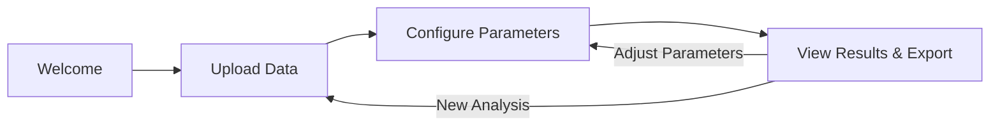
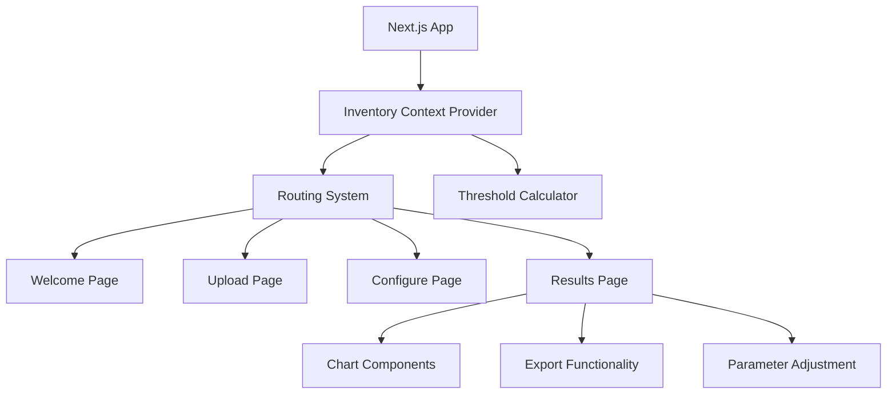
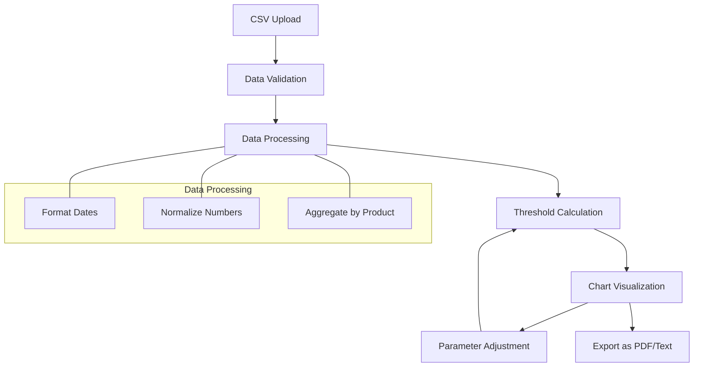
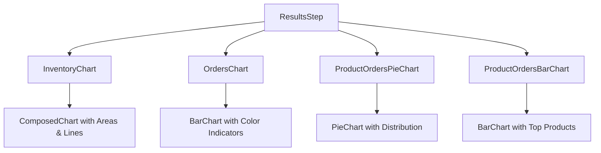
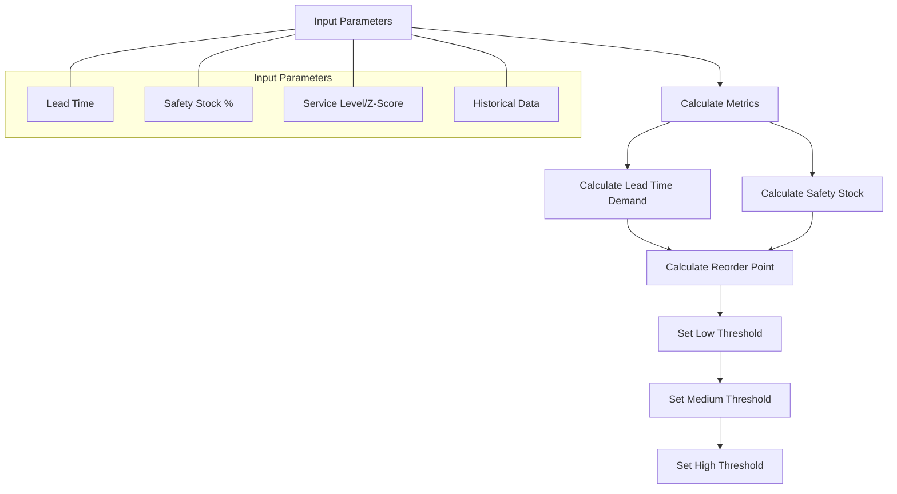
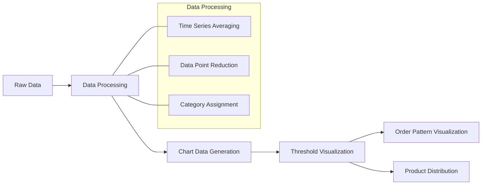
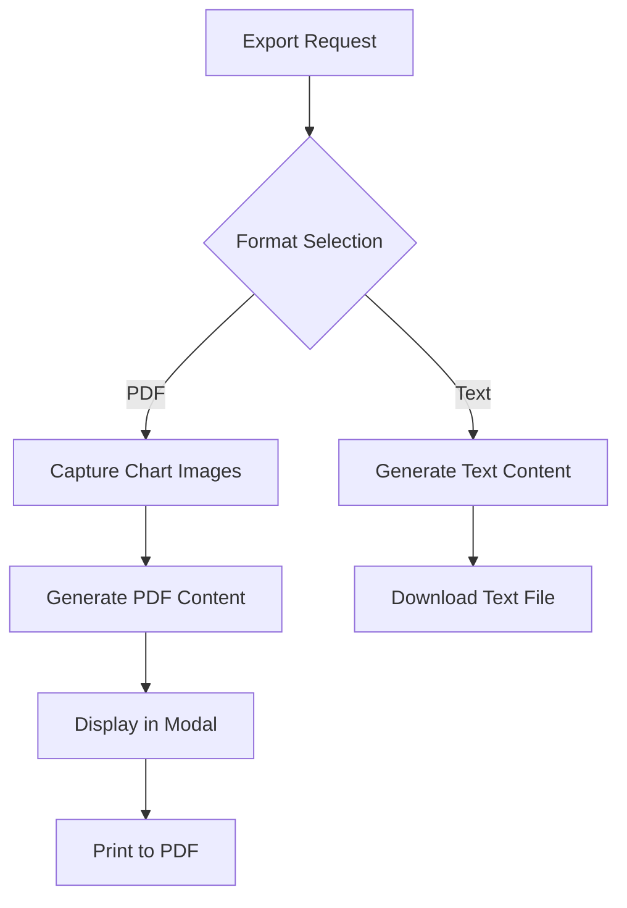

# Inventory Threshold Optimizer Documentation

## Table of Contents

1. [Introduction](#introduction)
2. [Application Overview](#application-overview)
3. [Application Architecture](#application-architecture)
4. [Data Flow](#data-flow)
5. [Component Breakdown](#component-breakdown)
6. [Threshold Calculation Algorithm](#threshold-calculation-algorithm)
7. [Chart Visualization](#chart-visualization)
8. [Export Functionality](#export-functionality)
9. [Installation and Setup](#installation-and-setup)
10. [Future Improvements](#future-improvements)

## Introduction

The Inventory Threshold Optimizer is a sophisticated web application designed to help e-commerce businesses optimize their inventory management through data-driven threshold calculations. By analyzing historical inventory and order data, the application provides optimized threshold levels, visualizations, and actionable insights to improve inventory control and reduce costs.

## Application Overview

The application guides users through a step-by-step process to analyze their inventory data:



### Key Features

- **Data Import**: Upload and validate inventory and order data in CSV format
- **Parameter Configuration**: Adjust lead time, safety stock, and service level settings
- **Visual Analytics**: Interactive charts showing inventory levels, orders, and product distribution
- **Dynamic Threshold Calculation**: Real-time threshold updates based on parameter adjustments
- **Export Options**: Export analysis as PDF (with chart images) or text format
- **Theme Support**: Light and dark mode for different user preferences

## Application Architecture

The application is built with a modern React/Next.js architecture using context for state management and a wizard-based flow for user interaction.



### Technical Stack

- **Frontend Framework**: Next.js (React)
- **Styling**: Tailwind CSS with custom theme
- **Charts**: Recharts library
- **State Management**: React Context API
- **Data Validation**: Zod schemas
- **PDF Export**: HTML-to-Canvas for chart capture

## Data Flow

The application follows a clear data flow pattern from import to visualization and export:



## Component Breakdown

### Wizard Steps

The application uses a step-based wizard approach to guide users:

1. **WelcomeStep**: Introduction to the application and required data format
2. **UploadStep**: CSV upload with validation and error handling
3. **ConfigureStep**: Parameter configuration with real-time updates
4. **ResultsStep**: Display of results, charts, and export options

### Chart Components

The application includes four main visualization components:

1. **InventoryChart**: Displays inventory levels over time with threshold zones
2. **OrdersChart**: Shows order volume with lead time indicators
3. **ProductOrdersPieChart**: Illustrates product distribution by order volume
4. **ProductOrdersBarChart**: Displays top products by order volume



## Threshold Calculation Algorithm

The core of the application is the inventory threshold calculation algorithm:



### Calculation Process

1. **Lead Time Demand**: Average daily sales × lead time
2. **Safety Stock**: Safety stock percentage × lead time demand
3. **Reorder Point**: Lead time demand + safety stock
4. **Low Threshold**: Reorder point × factor (critical level)
5. **Medium Threshold**: Between low and high (warning level)
6. **High Threshold**: Safe stock level

## Chart Visualization

The application uses a data-driven approach to visualize inventory levels and thresholds:



### Chart Features

- Color-coded threshold zones for quick visual assessment
- Lead time indicators with color coding based on delivery speed
- Interactive tooltips with detailed information
- Responsive design for different screen sizes
- Dynamic date range filtering

## Export Functionality

The application provides comprehensive export options:



### PDF Export Process

1. **Capture Charts**: Use HTML-to-Canvas to capture all chart elements
2. **Generate PDF Content**: Create a structured HTML template with chart images
3. **Display Preview**: Show the PDF preview in a modal
4. **Save as PDF**: Use browser print functionality to save as PDF

## Installation and Setup

```bash
# Clone the repository
git clone -b v1.0 https://github.com/yourusername/inventory-dashboard.git

# Navigate to project directory
cd inventory-dashboard

# Install dependencies
bun install

# Run the development server
bun dev
```